# Azure Static Website

A simple static website deployed to Microsoft Azure using the Azure Portal and Bicep.

The project was created as a practical exercise to learn Azure resource management, storage accounts, static website hosting, and basic cloud deployment workflows.

🔗 **Live demo:** `https://ststaticwebsite0129.z36.web.core.windows.net/`

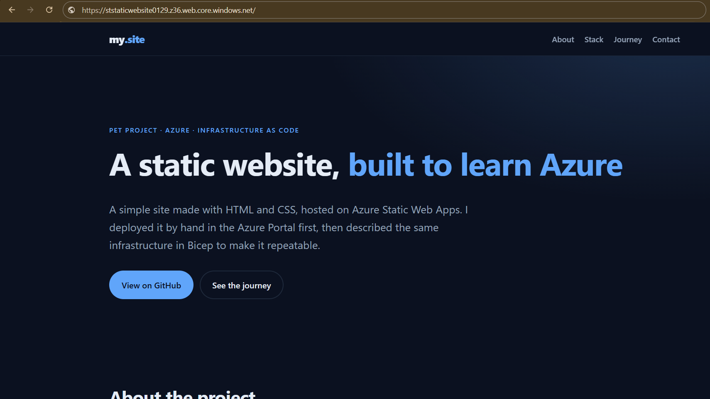

---

## Architecture

The project uses:

- **Azure Resource Group**
- **Azure Storage Account**
- **Static Website hosting**
- **Azure Blob Storage**
- **Azure Portal**
- **Bicep**
- **Azure CLI** 

The website files are stored in the `$web` container provided by Azure Static Website hosting.

```text
Resource Group (rg-static-website)
└── Storage Account (ststaticwebsite0129)
    └── Static Website
        └── $web
            ├── index.html
            ├── style.css
            └── 404.html
```

---

## Project Structure

```text
azure-static-website/
│
├── src/
│   ├── index.html
│   ├── style.css
│   └── 404.html
│
├── infrastructure/
│   ├── main.bicep
│   └── main.bicepparam
│
├── docs/
│   └── screenshots/
│       ├── 01-resource-group.png
│       ├── 02-storage-account.png
│       ├── 03-storage-account-tags.png
│       ├── 04-static-website.png
│       ├── 05-web-container.png
│       ├── 06-website-files.png
│       ├── 07-resources.png
│       ├── 08-website.png
│       ├── 01-what-if.png
│       ├── 02-deployment.png
│       ├── 03-website.png
│       └── 04-404-page.png
│
├── .gitignore
├── LICENSE
└── README.md
```

---

## Prerequisites

- An [Azure account](https://azure.microsoft.com/free/) (the free tier is enough)
- The website files from the `src/` folder

> Steps verified in October 2026. The Azure Portal UI may change slightly over time.

---

# Deployment using Azure Portal

Open the [Azure Portal](https://portal.azure.com/).

## Step 1 — Create a Resource Group

In the search bar, enter:

```text
Resource groups
```

Click **Resource groups → Create**.
Configure the resource group:

| Setting          | Value                     |
| ---------------- | ------------------------- |
| `Subscription`   | `Azure subscription 1`    |
| `Resource group` | `rg-static-website`       |
| `Region`         | `West Europe`             |

Open the **Tags** tab and add:

| Name          | Value            |
| ------------- | ---------------- |
| `project`     | `static-website` |
| `owner`       | `illia`          |
| `deployment`  | `portal`         |
| `purpose`     | `Pet-Project`    |

Click **Review + create**.

After validation completes, click **Create**.

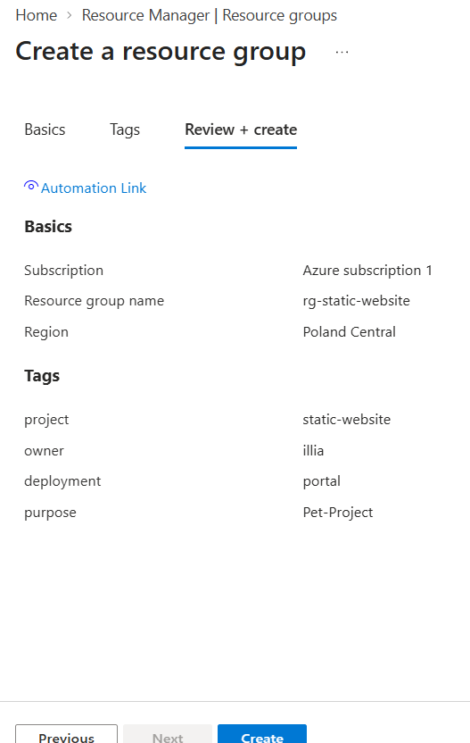

---

## Step 2 — Create a Storage Account

In the Azure Portal search bar, search for:

```text
Storage accounts
```

Click **Storage account → Create**.

**Basics**
Configure the storage account:

| Settings                 | Value                                               |
| ------------------------ | --------------------------------------------------- |
| `Subscription`           | `Azure subscription 1`                              |
| `Resource group`         | `rg-static-website`                                 |
| `Storage account name`   | `ststaticwebsite0129`                               |
| `Region`                 | `polandcentral`                                     |
| `Preferred storage type` | `Azure Blob Storage or Azure Data Lake Storage`     |
| `Performance`            | `Standard`                                          |
| `Redundancy`             | `LRS (Locally-redundant storage) `                  |

Open the **Tags** tab and add:

| Name          | Value            |
| ------------- | ---------------- |
| `project`     | `static-website` |
| `owner`       | `illia`          |
| `deployment`  | `portal`         |
| `purpose`     | `Pet-Project`    |

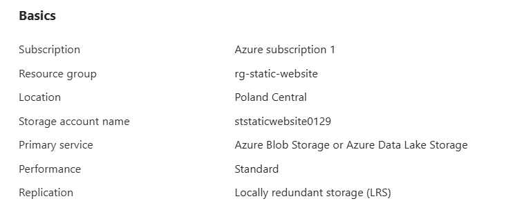

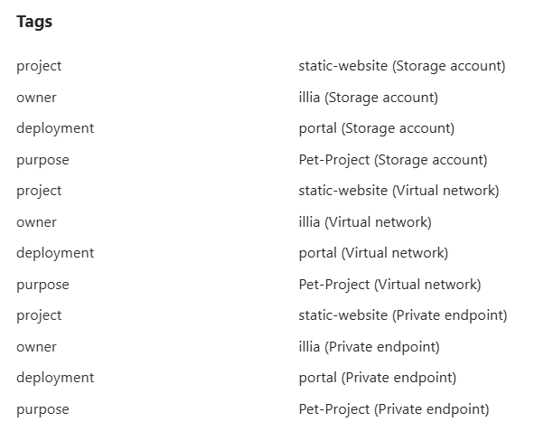

### Configure Another Settings

For this learning project, the default settings can be used for all another settings page.

Click **Review + create**.

After validation completes, click **Create**.

---

## Step 3 — Enable Static Website Hosting

Open the newly created Storage Account.

In the left menu, find:

```text
Data management
    → Static website
```

| Setting               | Value                     |
| --------------------- | ------------------------- |
| `Static website`      | `Enabled`                 |
| `Index document name` | `index.html`              |
| `Error document path` | `404.html`                |    

Click **Save**.

Azure will automatically create a special blob container:

```text
$web
```

This container is used to store the static website files.

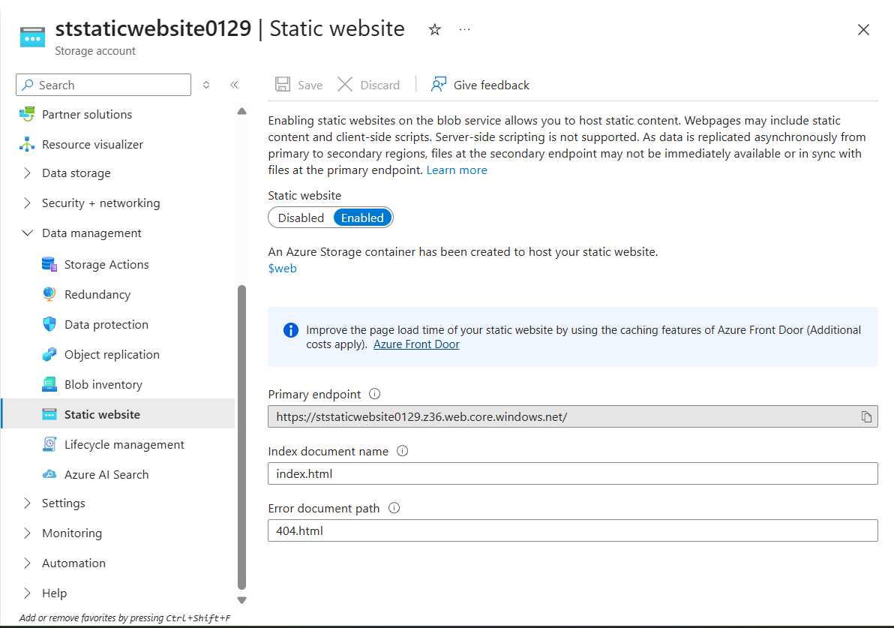

---

## Step 4 — Open the $web Container

In the Storage Account, go to:

```text
Data storage
    → Containers
```

Open:

```text
$web
```

The $web container is automatically created when Static Website hosting is enabled.

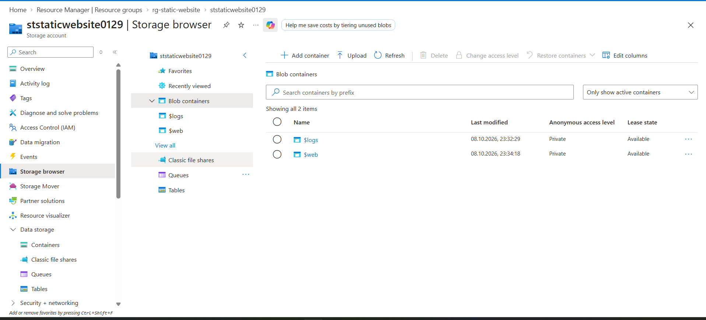

---

## Step 5 — Upload Website Files

Inside the $web container, click:

```text
Upload
```

Select the files from the src/ folder:

```text
index.html
style.css
404.html
```

Make sure that index.html is located in the root of the $web container, not inside a subfolder.

The final structure should look like this:

```text
$web/
│
├── index.html
├── style.css
└── 404.html
```

The site uses absolute paths such as /style.css, so the files must stay in the root of $web.

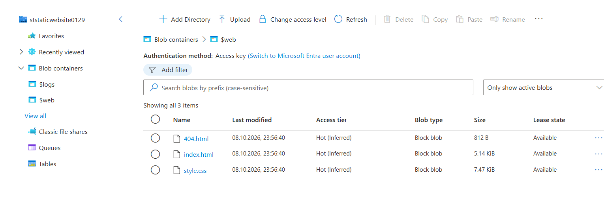

---

## Step 6 — Get the Website URL

Return to:

```text
Storage Account
    → Data management
    → Static website
```

Azure provides the Primary endpoint.

It will look similar to:

```text
https://ststaticwebsite0129.z36.web.core.windows.net/
```
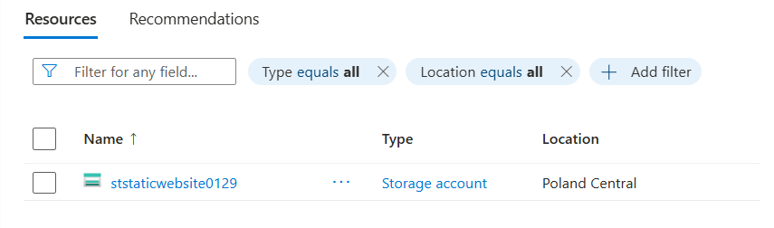

---

## Step 7 — Verify the Deployment

Check the following:

- [x] Resource Group was created successfully
- [x] Storage Account was created successfully
- [x] Static Website was enabled
- [x] `$web` container was created
- [x] Website files were uploaded
- [x] `index.html` is in the root of `$web`
- [x] Primary endpoint opens successfully
- [x] HTTPS padlock is shown in the browser
- [x] Styles are applied (DevTools → Network → `style.css` returns `200`)

You can also check from a terminal:

```powershell
Invoke-WebRequest -Uri https://ststaticwebsite0129.z36.web.core.windows.net/ -Method Head
```

Output:

```text
StatusCode        : 200
StatusDescription : OK
```

Finally, open **Resource Group → Overview** and confirm that the Storage Account is listed there.


*Deployed Azure Resources*

---

## Step 8 — Update the Website

1. Edit the files in the `website/` folder.
2. Open `$web` in the Storage Account.
3. Click **Upload** and select the changed files.
4. Enable **Overwrite if files already exist**.
5. Hard refresh the browser (`Ctrl+Shift+R`).

---

## Step 9 — Clean Up (Optional)

To avoid unexpected charges, delete everything at once:

```text
Resource groups → rg-static-website → Delete resource group
```

Type the resource group name to confirm.

---

# Azure Resources

The final Azure environment contains:

```text
Resource Group
└── Storage Account
    └── Static Website
        └── $web
            ├── index.html
            ├── style.css
            └── 404.html
```

---

# Troubleshooting

| Problem                                               | Solution                                                                 |
| ----------------------------------------------------- | ------------------------------------------------------------------------ |
| Storage account name is not accepted                  | Use 3–24 lowercase letters and numbers only, and make it unique          |
| `$web` container is missing                           | Static website is not enabled yet, enable it and click **Save**          |
| Endpoint shows "The requested content does not exist" | `index.html` is not in the root of `$web`, or the name differs           |
| Page opens without styles                             | `style.css` was not uploaded, or it is in a subfolder                    |
| Changes do not appear                                 | Re-upload with overwrite enabled, wait a minute, hard refresh            |
| Unexpected charges                                    | Check that Defender for Storage is off, or delete the resource group     |

---

# What I Learned

This project helped me practice:

- Creating Azure Resource Groups
- Creating Azure Storage Accounts
- Using tags to organize resources
- Understanding Azure Storage configuration
- Enabling Static Website hosting
- Working with Blob Containers
- Uploading files to Azure
- Finding and testing Azure endpoints
- Managing Azure resources through the Azure Portal

---

# Deployment using Bicep

The same infrastructure as in the Portal method, now described as code.
Bicep creates the Storage Account, and Azure CLI then enables static website hosting and uploads the files.

> Storage account names are globally unique. The Portal and Bicep methods use the same name, so the Portal resources were deleted before running this deployment.

---

## Project files

```text
infrastructure/
├── main.bicep          # Storage Account definition
└── main.bicepparam     # Parameter values (name, region, tags)
```

---

## Prerequisites (Bicep)

- An [Azure account](https://azure.microsoft.com/free/)
- [Azure CLI](https://learn.microsoft.com/cli/azure/install-azure-cli)
- Bicep tools, installed with the CLI:

```powershell
az --version
az bicep install
az bicep version
```

## Parameters used

| Parameter            | Value                 | Defined in           |
| -------------------- | --------------------- | -------------------- |
| `storageAccountName` | `ststaticwebsite0129` | `main.bicepparam`    |
| `location`           | `polandcentral`       | `main.bicepparam`    |
| `tags`               | see below             | `main.bicepparam`    |
| Resource group       | `rg-static-website`   | CLI command          |

Tags are passed as a single object, so they can be changed in the parameters file without editing the template:

| Name         | Value            |
| ------------ | ---------------- |
| `project`    | `static-website` |
| `owner`      | `illia`          |
| `deployment` | `bicep`          |
| `purpose`    | `Pet-Project`    |

---

## Step 1 — Sign in and set variables


```powershell
az login
az account show --query "{name:name, id:id}" -o table
```

Set variables once, so the following commands can be copied as they are:

```powershell
$RG = "rg-static-website"
$SA = "ststaticwebsite0129"
$LOCATION = "polandcentral"
```

---

## Step 2 — Create the resource group

A Bicep template deployed at resource group scope needs an existing group:

```powershell
az group create --name $RG --location $LOCATION --tags project=static-website owner=illia deployment=bicep purpose=Pet-Project
```

Output:

```json
{  
  "id": "/subscriptions/<subscription-id>/resourceGroups/rg-static-website",
  "location": "polandcentral",
  "managedBy": null,
  "name": "rg-static-website",
  "properties": {
    "provisioningState": "Succeeded"
  },
  "tags": {
    "deployment": "bicep",
    "owner": "illia",
    "project": "static-website",
    "purpose": "Pet-Project"
  },
  "type": "Microsoft.Resources/resourceGroups"
}
```

---

## Step 3 — Validate the template

Check the syntax without creating anything:

```powershell
az bicep build --file infrastructure/main.bicep --stdout > $null
```

No output means no errors.

Preview what Azure is going to create:

```powershell
az deployment group what-if --resource-group $RG --parameters infrastructure/main.bicepparam
```

The output should show one resource to create (`Microsoft.Storage/storageAccounts`).

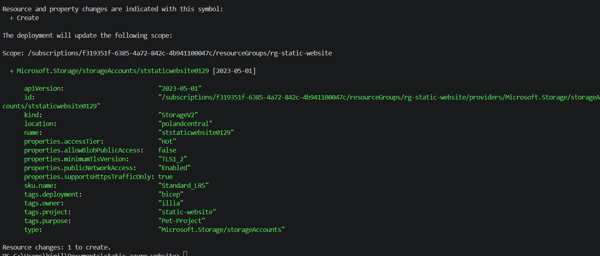

---

## Step 4 — Deploy the infrastructure

```powershell
az deployment group create --name static-website-deployment --resource-group $RG --parameters infrastructure/main.bicepparam
```

When it finishes, the output shows `"provisioningState": "Succeeded"` and the template outputs:

Output (shortened):

```json
{
  "name": "static-website-deployment",
  "properties": {
    "duration": "PT27.7943556S",
    "mode": "Incremental",
    "outputs": {
      "staticWebsiteUrl": {
        "type": "String",
        "value": "https://ststaticwebsite0129.z36.web.core.windows.net/"
      },
      "storageAccountName": {
        "type": "String",
        "value": "ststaticwebsite0129"
      }
    },
    "provisioningState": "Succeeded"
  },
  "resourceGroup": "rg-static-website"
}
```

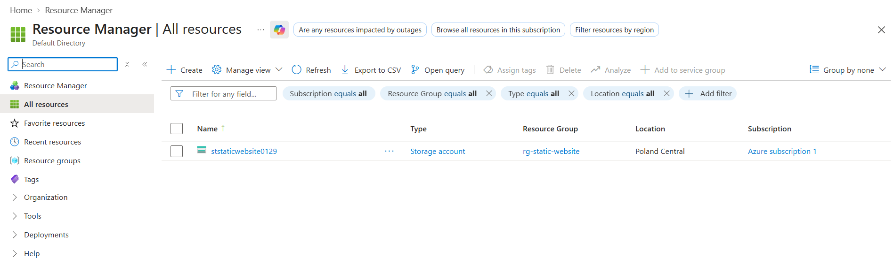

---

## Step 5 — Grant data access

Creating the Storage Account does not give your user permission to work with its data.
Assign the data plane role to yourself:

```powershell
$USER_ID = az ad signed-in-user show --query id -o tsv
$SA_ID = az storage account show --name $SA --resource-group $RG --query id -o tsv

az role assignment create --assignee $USER_ID --role "Storage Blob Data Contributor" --scope $SA_ID
```

The command returns the created role assignment as JSON. No error means the role was assigned.

> The role can take a few minutes to apply. If the next steps return an authorization error, wait and retry.

---

## Step 6 — Enable static website hosting

Static website hosting is a **data plane** setting of the storage account, so Bicep (control plane) does not configure it. It is enabled with Azure CLI:

```powershell
az storage blob service-properties update --account-name $SA --static-website --index-document index.html --404-document 404.html --auth-mode login
```

Azure creates the `$web` container automatically. Check it:

```powershell
az storage container list --account-name $SA --auth-mode login -o table
```

Output:
```text
Name    Lease Status    Last Modified
------  --------------  -------------------------
$web                    2026-10-09T20:41:37+00:00
```

---

## Step 7 — Upload the website files

Run from the repository root:

```powershell 
az storage blob upload-batch --account-name $SA --destination '$web' --source ./src --overwrite --auth-mode login
```

Output:

```json
[
  {
    "Blob": "https://ststaticwebsite0129.blob.core.windows.net/%24web/404.html",
    "Last Modified": "2026-10-09T20:50:41+00:00",
    "Type": "text/html",
    "eTag": "\"0x8DF2646FB5DE327\""
  },
  {
    "Blob": "https://ststaticwebsite0129.blob.core.windows.net/%24web/index.html",
    "Last Modified": "2026-10-09T20:50:41+00:00",
    "Type": "text/html",
    "eTag": "\"0x8DF2646FB6DF927\""
  },
  {
    "Blob": "https://ststaticwebsite0129.blob.core.windows.net/%24web/style.css",
    "Last Modified": "2026-10-09T20:50:41+00:00",
    "Type": "text/css",
    "eTag": "\"0x8DF2646FB79D6D0\""
  }
]
```

The contents of `src/` land in the root of `$web`:

```text
$web/
├── index.html
├── style.css
└── 404.html
```

---

## Step 8 — Get the website URL

```powershell
az storage account show --name $SA --resource-group $RG --query "primaryEndpoints.web" -o tsv
```
```text
https://ststaticwebsite0129.z36.web.core.windows.net/
```

---

## Step 9 — Verify the deployment
- [x] Resource group was created
- [x] Deployment finished with `Succeeded`
- [x] Tags are present on the storage account
- [x] `$web` container exists
- [x] Files are in the root of `$web`
- [x] Primary endpoint opens in a browser
- [x] HTTPS padlock is shown

Check tags:

```powershell
az storage account show --name $SA --resource-group $RG --query tags
```

Output:

```json
{
  "deployment": "bicep",
  "owner": "illia",
  "project": "static-website",
  "purpose": "Pet-Project"
}
```

Check the site from the terminal:

```powershell
Invoke-WebRequest -Uri https://ststaticwebsite0129.z36.web.core.windows.net/ -Method Head
```

Output:

```text
StatusCode        : 200
StatusDescription : OK
```

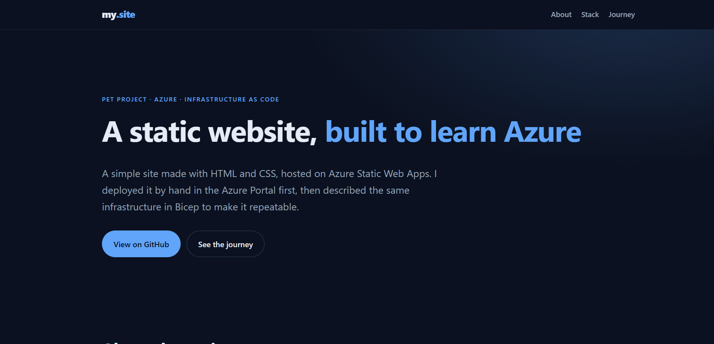

Open a non-existing address (for example `/abc`) to see the custom `404.html`.

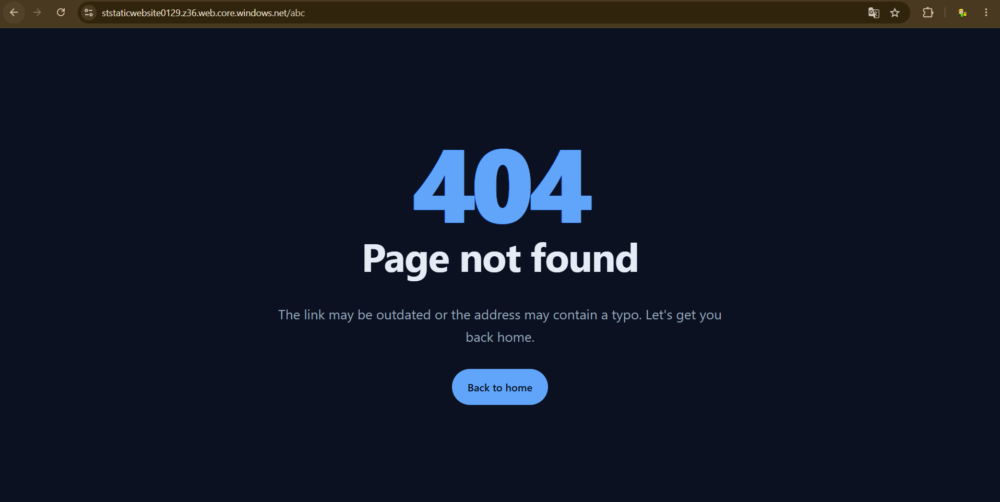

---

## Step 10 — Update the website

```powershell
az storage blob upload-batch --account-name $SA --destination '$web' --source ./src --overwrite --auth-mode login
```

Then hard refresh the browser (`Ctrl+Shift+R`).

---

## Step 11 — Clean up (optional)


```powershell
az group delete --name $RG --yes --no-wait
```

---

## How the template works

| Part of `main.bicep`              | Purpose                                                        |
| --------------------------------- | -------------------------------------------------------------- |
| `param storageAccountName`        | Globally unique name, validated with `@minLength`/`@maxLength` |
| `param location`                  | Region, defaults to the resource group region                  |
| `param tags object = {}`          | All tags passed as one object, optional                        |
| `kind: 'StorageV2'`               | Account type that supports static website hosting              |
| `sku: Standard_LRS`               | Standard performance, locally redundant storage                |
| `supportsHttpsTrafficOnly`        | HTTPS only                                                     |
| `minimumTlsVersion: 'TLS1_2'`     | Minimum TLS version                                            |
| `allowBlobPublicAccess: false`    | Containers are not anonymously readable directly               |
| `output staticWebsiteUrl`         | Website address shown after deployment                         |

The `.bicepparam` file contains only values and starts with `using 'main.bicep'`, which links it to the template. Deployment functions such as `resourceGroup()` are available only in the template, not in the parameters file.

---


## Portal vs Bicep

| Aspect                 | Azure Portal                           | Bicep                                        |
| ---------------------- | -------------------------------------- | -------------------------------------------- |
| First deployment       | Faster to start, nothing to learn      | Slower, template has to be written           |
| Repeatability          | Manual clicks every time               | One command, same result                     |
| Risk of human error    | Higher (typos, forgotten tags)         | Lower, values are in files                   |
| Version control        | Only screenshots and README            | Template and parameters stored in Git        |
| Preview of changes     | None                                   | `what-if` before deployment                  |
| Manual steps left      | Everything                             | Static website, file upload, role assignment |

---

## Troubleshooting (Bicep)

| Problem                                              | Solution                                                                                   |
| ---------------------------------------------------- | ------------------------------------------------------------------------------------------ |
| `StorageAccountAlreadyTaken`                         | The name is globally taken. Delete the old account or change `storageAccountName`          |
| Red underline in `main.bicepparam`                   | Parameter name or type differs from `main.bicep`, or a deployment function was used        |
| `AuthorizationPermissionMismatch` / 403 on CLI steps | Data role not assigned yet (Step 5). Wait a few minutes after assigning                    |
| Resource group not found                             | Run Step 2 first, or check the `$RG` variable                                              |
| `$web` upload goes to the wrong place                | Use single quotes: `'$web'`                                                                |
| Site returns 404 on the main page                    | `index.html` is not in the root of `$web`                                                  |
| Changes do not appear                                | Re-upload with `--overwrite`, wait a minute, hard refresh                                  |
| Region not available for the subscription            | Choose another region in `main.bicepparam`                                                 |

---

## What I learned (Bicep)

- Writing a Bicep template with parameters, decorators and outputs
- Separating values (`.bicepparam`) from the template (`.bicep`)
- Passing tags as a single object parameter
- Previewing changes with `what-if`
- The difference between the control plane (Bicep creates the resource) and the data plane (CLI configures static website hosting and uploads files)
- Why Azure role assignments are needed for data plane access
- Bicep compiles to ARM JSON, which does not need to be committed